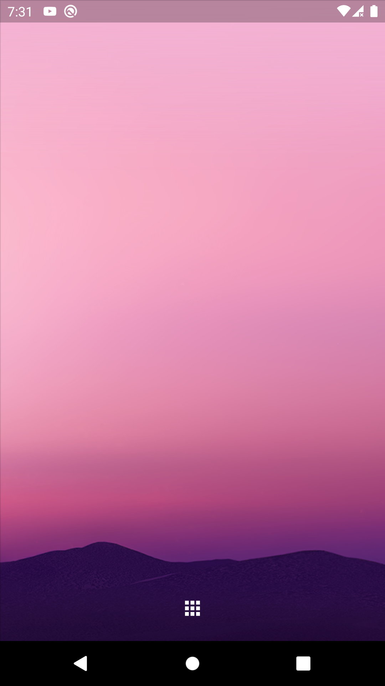
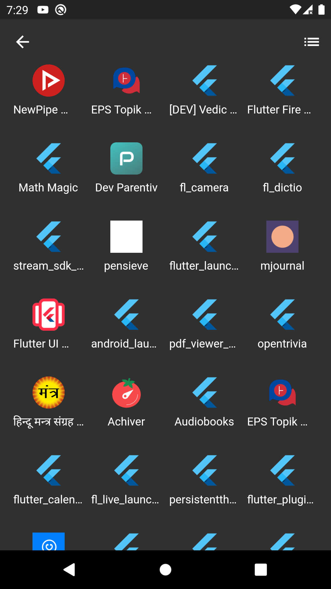
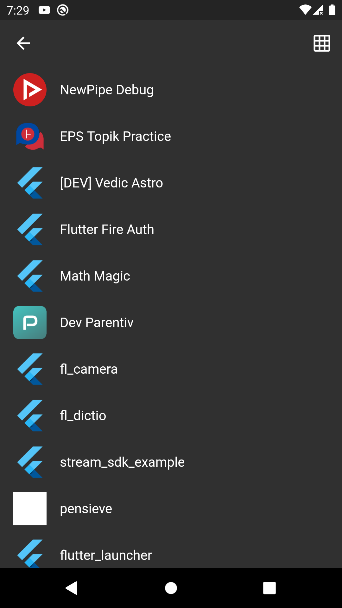

# Android Launcher
Android Launcher app using Flutter, developed [live on YouTube](https://youtu.be/5QJU3QIBLIw)

## Preview
  

## Features
- Uses [riverpod](https://riverpod.dev) as state management
- Displays system wallpaper as background
- List applications in Grid or List view
- Launch applications

